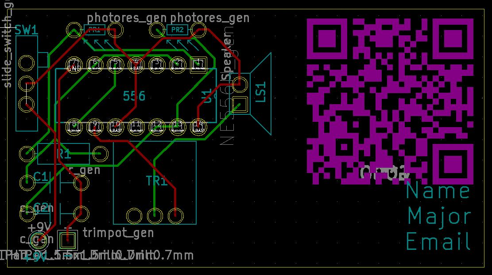
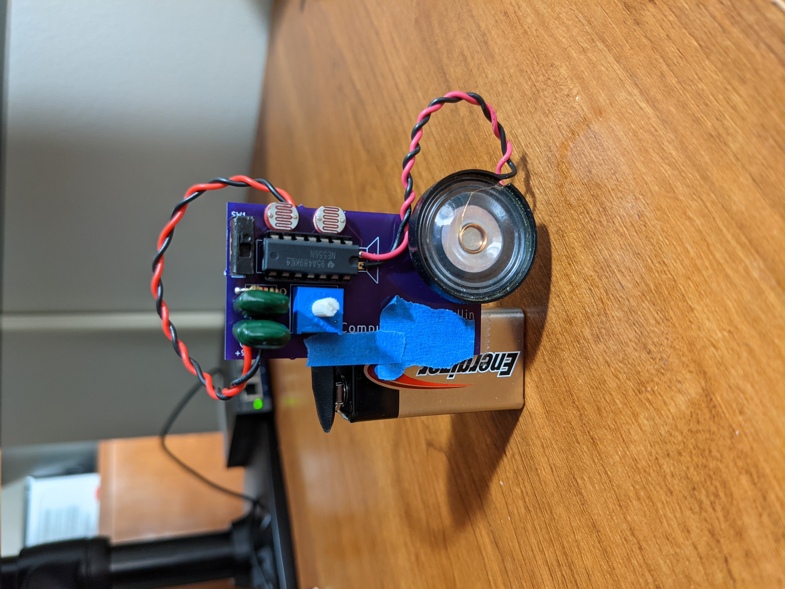

# STG Business Card

## Motive
The motive behind this project is to provide to prospective employers an example of my pcb work in a form factor that is easy for them to carry around. I came up with the idea of putting a simple Stepped Tone Generator onto a PCB the size of a business card after watching a video from [Look Mum No Computer](https://www.youtube.com/watch?v=4lK7kdgK7dI), where he builds an Atari Punk Console (Stepped Tone Generator). Using the same instructables guide from [BrownDogGadgets](https://www.instructables.com/Build-an-Atari-Punk-circuit-on-a-breadboard/). 

## PCB Design
I used KiCad to draw up the schematic and designed a PCB to go with it. The PCB is a 2-layer design with through-hole components. Below are pictures of the 3D model and the PCB layout in KiCad.   

## Bill of Materials
| Description      | Ref      | Component Value | Part #            | Link                                                                                                        |
| ---------------- | -------- | --------------- | ----------------- | ----------------------------------------------------------------------------------------------------------- |
| Resistor         | R1       | 1K              | CFR-25JB-52-1K    | [Digi-key](https://www.digikey.com/en/products/detail/yageo/CFR-25JB-52-1K/96)                              |
| Capacitor        | C1, C2   | 0.22u           | K224M20X7RF53H5 | [Mouser](https://www.mouser.com/ProductDetail/Vishay-BC-Components/K224M20X7RF53H5?qs=ODefv%2FJbNkjoPr%252Bz4Qq7xw%3D%3D)            |
| 556 Timer        | U1       | 556             | NE556N            | [Mouser](https://www.mouser.com/ProductDetail/Texas-Instruments/NE556N?qs=gb35HGp1gQKUkn%252B6zgU6RA%3D%3D) |
| IC Socket        | U1       | 14 Pin DIP      | ICS-314-T         | [Digi-Key](https://www.digikey.com/en/products/detail/adam-tech/ICS-314-T/9832866)
| Photoresistor    | PR1, PR2 | 1k - 10k        | 161               | [Adafruit](https://www.adafruit.com/product/161)                                                            |
| Trimmer Resistor | TR1      | 5k              | 3386T             | [Mouser](https://www.mouser.com/ProductDetail/Bourns/3386T-1-502LF?qs=0VqvB9JLnIv4eQGVkebFKQ%3D%3D)         | 
| Speaker          | LS1      | 8 ohm           | 1890              | [Adafruit](https://www.adafruit.com/product/1890)                                                           |
| Switch           | SW1      | SPDT            | 805               | [Adafruit](https://www.adafruit.com/product/805)                                                            |
| 9V Battery Clip  | Batt/9V  | 9V              | 235               | [Mouser](https://www.mouser.com/ProductDetail/Keystone-Electronics/235?qs=w4ABFRoM%2FL90W35cnqrFmA%3D%3D)   |

## Assembly Order
For ease of assembly, start with the lower profile compoents and work up to the higher profile compoents.

I assembled the circuit in this order: 
1. Resistor and Photoresistors 
2. IC Socket
3. Capacitors
4. Switch
5. Potentiometer
6. Speaker and Battery Clip
7. IC

## Assembled Circuit
Below is an assembled STG circuit. A demo of the circuit can be found here.

## Postmortem
Overall, I happy with the final product. However, I may add an additional PCB, to this project, that swaps out the photoresistors to use potentiometer. 
